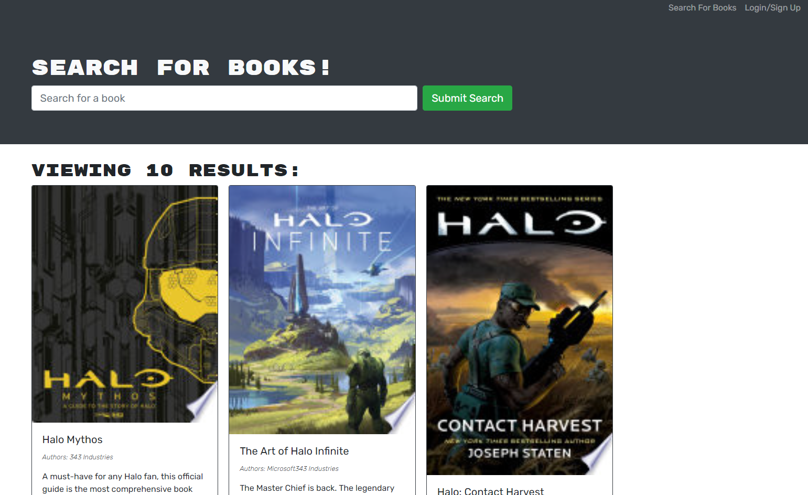

# book-search-engine

## Description

This application allows the user to search for books in the Google Books API, and save the ones they are interested in. It is useful for any avid reader looking for more books to read in the future. I built it to learn more about GraphQL and Apollo, as well as the full MERN Stack. I also learned how to use MongoDB atlas to deploy an application with Heroku.

Link to deployed application:
https://limitless-headland-71595.herokuapp.com/

## Usage
See screenshot below. Use the button in the upper right corner to create an account, and then use the search bar to find books. When you are logged in you can save books to your collection, which you can view with the See Your Books button.

   
## Credits
This application uses the Google Books API. It requires graphQL to run, and was deployed using heroku. I recieved some assistance from my tutor, Vinnie Lopez.

## License
Copyright (c) 2022 Gabriel Guerin

Permission is hereby granted, free of charge, to any person obtaining a copy of this software and associated documentation files (the "Software"), to deal in the Software without restriction, including without limitation the rights to use, copy, modify, merge, publish, distribute, sublicense, and/or sell copies of the Software, and to permit persons to whom the Software is furnished to do so, subject to the following conditions:

The above copyright notice and this permission notice shall be included in all copies or substantial portions of the Software.

THE SOFTWARE IS PROVIDED "AS IS", WITHOUT WARRANTY OF ANY KIND, EXPRESS OR IMPLIED, INCLUDING BUT NOT LIMITED TO THE WARRANTIES OF MERCHANTABILITY, FITNESS FOR A PARTICULAR PURPOSE AND NONINFRINGEMENT. IN NO EVENT SHALL THE AUTHORS OR COPYRIGHT HOLDERS BE LIABLE FOR ANY CLAIM, DAMAGES OR OTHER LIABILITY, WHETHER IN AN ACTION OF CONTRACT, TORT OR OTHERWISE, ARISING FROM, OUT OF OR IN CONNECTION WITH THE SOFTWARE OR THE USE OR OTHER DEALINGS IN THE SOFTWARE.
